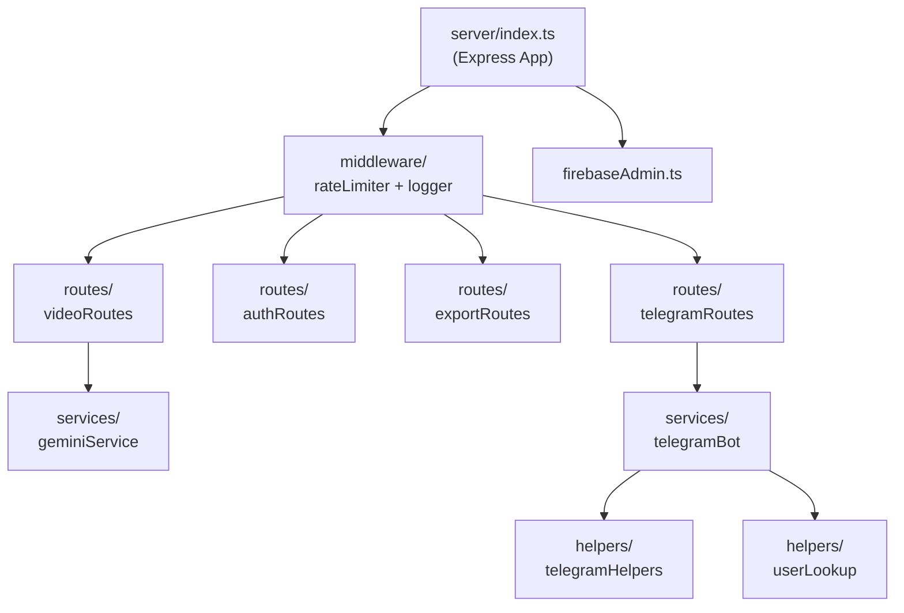

# 📋 Plan.md — خطة العمل الشاملة لإصلاح وتطوير YT-Summarizer-AI

> **تاريخ الإنشاء:** 25 يوليو 2026
> **الحالة:** في انتظار الموافقة

---

## 📌 الملخص التنفيذي

هذه الخطة تغطي **5 مراحل** لتحويل المشروع من حالته الحالية (Monolithic + ثغرات أمنية + تعارضات بنيوية) إلى مشروع **نظيف، آمن، مُختبَر، وقابل للتوسع** مع فصل الـ Backend عن الـ Frontend واستضافة كل منهما في المكان الأمثل.

---

## المرحلة 1: إصلاح التعارض الحرج — Firebase Admin SDK 🔴

### المشكلة
بعد تفعيل قواعد Firestore الجديدة الآمنة، أصبح هناك **تعارض جوهري**: الخادم (`server.ts`) يستخدم **Firebase Client SDK** (المخصص للمتصفح) للقراءة والكتابة في Firestore. لكن القواعد الجديدة تتطلب `request.auth != null` — والخادم لا يمتلك جلسة مصادقة! هذا يعني أن:

- ❌ بوت تلغرام لن يستطيع إنشاء مستخدمين أو حفظ ملخصات
- ❌ إنشاء Login Tokens سيفشل (القواعد تمنع العميل)
- ❌ نظام Trial Usage لن يعمل
- ❌ حفظ إعدادات المستخدم من الخادم سيفشل

### الحل
استبدال Firebase Client SDK بـ **Firebase Admin SDK** في جانب الخادم فقط. الـ Admin SDK يتجاوز قواعد الأمان تلقائياً (لأنه يعمل بصلاحيات الخادم الكاملة)، وهذا هو التصميم الصحيح المُوصى به من Google.

### الملفات المتأثرة

| الملف | التغيير | الوصف |
|-------|---------|------|
| `server.ts` | تعديل جذري | استبدال imports من `firebase/firestore` إلى `firebase-admin/firestore` |
| `src/services/trialService.ts` | تعديل | إنشاء نسخة خادم تستخدم Admin SDK |
| **[جديد]** `server/firebaseAdmin.ts` | ملف جديد | إعداد Firebase Admin SDK مع Service Account |
| `src/lib/firebase.ts` | يبقى كما هو | يظل Client SDK للواجهة الأمامية فقط |

### المتطلبات
- تنزيل ملف **Service Account Key** من Firebase Console → Project Settings → Service Accounts → Generate new private key
- إضافة مسار الملف أو محتواه كمتغير بيئة `FIREBASE_SERVICE_ACCOUNT`

### النتيجة المتوقعة
- ✅ الخادم يتعامل مع Firestore بصلاحيات Admin بدون قيود القواعد
- ✅ الواجهة الأمامية محمية بقواعد الأمان الجديدة
- ✅ بوت تلغرام يعمل بدون مشاكل

---

## المرحلة 2: إعادة هيكلة `server.ts` إلى Clean Architecture 🏗️

### المشكلة
ملف `server.ts` يحتوي على **2,022 سطر** في ملف واحد ضخم يجمع:
- Express Routes (13+ endpoint)
- Telegram Bot Logic بالكامل (~1,000 سطر)
- HTML Generation للتصدير
- Authentication Helpers
- Trial System

### الحل — الهيكل الجديد المقترح

```
server/
├── index.ts                    ← نقطة الدخول: Express setup + server start
├── firebaseAdmin.ts            ← إعداد Firebase Admin SDK
├── middleware/
│   ├── rateLimiter.ts          ← حماية Rate Limiting
│   ├── requestLogger.ts        ← تسجيل الطلبات
│   └── baseUrlTracker.ts       ← تتبع URL الخارجي لتلغرام
├── routes/
│   ├── videoRoutes.ts          ← /api/process-video, /api/summary/:id
│   ├── authRoutes.ts           ← /api/auth/login-with-token, /api/save-user-config
│   ├── exportRoutes.ts         ← /api/export-file, /api/notion/export, /api/document/refine
│   ├── trialRoutes.ts          ← /api/trial-status
│   ├── telegramRoutes.ts       ← /api/telegram-webhook, /api/telegram-bot-info
│   └── healthRoutes.ts         ← /api/health
├── services/
│   ├── telegramBot.ts          ← معالجة رسائل وأوامر تلغرام
│   ├── telegramPolling.ts      ← محرك Long Polling
│   └── telegramHelpers.ts      ← دوال إرسال/تعديل رسائل تلغرام
├── helpers/
│   ├── htmlExporter.ts         ← توليد HTML لتصدير Word/PDF
│   ├── userLookup.ts           ← البحث عن المستخدمين بالإيميل/تلغرام
│   └── loginToken.ts           ← إنشاء والتحقق من Login Tokens
└── types/
    └── index.ts                ← أنواع TypeScript المشتركة للخادم
```

### آلية العمل



### قواعد التقسيم
1. كل ملف Route يجب ألا يتجاوز **200 سطر**
2. كل ملف Service يجب ألا يتجاوز **300 سطر**
3. لا يوجد ملف يحتوي على أكثر من **مسؤولية واحدة** (Single Responsibility)
4. جميع الدوال المساعدة (Helpers) تكون **Pure Functions** قدر الإمكان

### النتيجة المتوقعة
- ✅ سهولة تتبع الأخطاء وصيانة الكود
- ✅ كل مطور يفهم الملف في أقل من 30 ثانية
- ✅ إضافة ميزات جديدة بسرعة دون خوف من كسر شيء آخر

---

## المرحلة 3: تأمين الخادم وتحسين الاستقرار 🔒

### 3.1 إضافة Rate Limiting

**المكتبة:** `express-rate-limit`

| الحماية | الحد | الهدف |
|---------|-----|-------|
| عامة | 60 طلب/دقيقة لكل IP | حماية أساسية |
| تلخيص الفيديو | 5 طلبات/دقيقة لكل IP | حماية حصة Gemini |
| تصدير Notion | 10 طلبات/دقيقة لكل IP | حماية Notion API |

### 3.2 إضافة Input Sanitization

| النقطة | الوصف | الحل |
|-------|------|------|
| رابط الفيديو | التحقق بـ regex + URL parsing | دالة `validateYouTubeUrl()` |
| بيانات المستخدم | تنظيف قبل حفظها في Firestore | دالة `sanitizeUserInput()` |
| محتوى HTML للتصدير | منع XSS في تصدير Word/PDF | استخدام `escape-html` |

### 3.3 إصلاح توافق Vercel Serverless

**المشكلة الجوهرية:** `(async () => { ... })()` بعد `res.json()` تُقطع على Vercel.

**الحل:** تعديل `/api/process-video` ليكون **متزامناً بالكامل** — ينتظر انتهاء التلخيص ثم يرد:

```typescript
// النمط الجديد: معالجة متزامنة
app.post('/api/process-video', async (req, res) => {
  try {
    const result = await summarizeVideoWithGemini(videoUrl, apiKey, language, userId);
    const docRef = await addDoc(collection(db, 'summaries'), {
      ...summaryData,
      status: 'completed',
      summaryText: result.summary
    });
    return res.json({ success: true, summaryId: docRef.id, status: 'completed', ...result });
  } catch (error) {
    return res.status(500).json({ success: false, error: error.message });
  }
});
```

> [!IMPORTANT]
> هذا التعديل يعني أن العميل (Frontend) سيحتاج تعديل بسيط أيضاً: بدلاً من Polling كل ثانيتين، سيتلقى النتيجة مباشرة في الرد الأول. سيتم تحديث `SummarizerForm.tsx` وفقاً لذلك.

### النتيجة المتوقعة
- ✅ حماية من هجمات DDoS واستهلاك الحصص
- ✅ منع XSS والحقن في المدخلات
- ✅ التلخيص يعمل بشكل موثوق على Vercel وعلى الخادم المستقل

---

## المرحلة 4: اختيار الاستضافة وفصل Backend عن Frontend 🌐

### مقارنة الخيارات المجانية

| المنصة | النوع | مجاني دائم؟ | Long Polling؟ | Background Jobs؟ | التعقيد |
|--------|------|------------|--------------|------------------|---------|
| **Render** | PaaS | ✅ (750 ساعة/شهر) | ✅ | ✅ | 🟢 منخفض |
| **Google Cloud Run** | Serverless Container | ✅ (2M طلب/شهر) | ❌ (Scale to Zero) | ⚠️ محدود | 🟡 متوسط |
| **Koyeb** | Serverless Container | ✅ (طبقة مجانية) | ✅ | ✅ | 🟢 منخفض |
| **Oracle Cloud** | VM (Always Free) | ✅ (دائم 24/7) | ✅ | ✅ | 🔴 عالي |
| **Vercel** (الحالي) | Serverless Functions | ✅ | ❌ | ❌ | 🟢 منخفض |

> [!TIP]
> **التوصية: Render (Free Tier)** — أسهل خيار، يدعم Express.js + Long Polling، 750 ساعة/شهر كافية لخدمة واحدة 24/7، ويمكن إبقاؤه حياً بخدمة UptimeRobot مجاناً.

### الهيكل النهائي للنشر

```
┌─────────────────────────────────┐      ┌──────────────────────────────┐
│  Vercel (Frontend فقط)          │      │  Render (Backend API)         │
│                                 │      │                              │
│  • React + Vite SPA             │ ──── │  • Express.js Server          │
│  • Static Files                 │ API  │  • Telegram Bot (Long Poll)   │
│  • CDN + Edge Caching           │ ──── │  • Gemini AI Processing       │
│                                 │      │  • Notion Export              │
└─────────────────────────────────┘      │  • Firebase Admin SDK         │
                                         └──────────────────────────────┘
                                                     │
                                         ┌──────────────────────────────┐
                                         │  Firebase (Database)          │
                                         │  • Firestore                  │
                                         │  • Authentication             │
                                         └──────────────────────────────┘
```

### التغييرات المطلوبة لفصل الـ Frontend

| الملف | التغيير |
|-------|---------|
| `vite.config.ts` | إضافة `proxy` للـ API requests في التطوير المحلي |
| `src/` جميع ملفات الخدمات | تغيير المسارات من `/api/...` إلى `VITE_API_URL/api/...` |
| `.env` | إضافة `VITE_API_URL=https://your-backend.onrender.com` |
| `vercel.json` | حذف rewrites للـ API (لم تعد مطلوبة) |

> [!NOTE]
> **القرار النهائي لك:** بعد مراجعة الخيارات أعلاه، أخبرني بالمنصة المفضلة وسأكمل خطوات النشر عليها.

---

## المرحلة 5: الاختبارات الشاملة 🧪

### 5.1 Unit Tests (Mock-based)

**الإطار:** Jest + ts-jest (مثبت مسبقاً)

#### اختبارات الخدمات (Services)

| ملف الاختبار | الوحدة المُختبرة | الحالات المُغطاة |
|-------------|-----------------|-----------------|
| `geminiService.test.ts` | `getYouTubeId()` | روابط صحيحة (watch, shorts, embed, youtu.be)، روابط خاطئة، حالات حدية |
| `geminiService.test.ts` | `extractPlayerResponse()` | JSON صحيح، HTML مشوّه، consent page |
| `geminiService.test.ts` | `parseYoutubeCaptionsXml()` | XML عادي، entities مشفّرة، فارغ |
| `geminiService.test.ts` | `summarizeVideoWithGemini()` | نجاح، فشل API key، quota exhausted، fallback لموديل آخر |
| `notionService.test.ts` | `markdownToNotionBlocks()` | عناوين، جداول، كود، قوائم، روابط، callouts |
| `notionService.test.ts` | `exportToNotion()` | نجاح، unauthorized، database not found، validation error |
| `trialService.test.ts` | `checkAndRecordTrialUsage()` | أول استخدام، في فترة الانتظار، بعد انتهاء الانتظار |
| `firebaseService.test.ts` | جميع الدوال | CRUD operations مع mock Firestore |

#### اختبارات الـ Routes

| ملف الاختبار | الـ Route | الحالات المُغطاة |
|-------------|---------|-----------------|
| `videoRoutes.test.ts` | `POST /api/process-video` | رابط صحيح، رابط خاطئ، بدون رابط، trial cooldown، custom API key |
| `videoRoutes.test.ts` | `GET /api/summary/:id` | موجود، غير موجود، processing، error status |
| `authRoutes.test.ts` | `POST /api/auth/login-with-token` | token صحيح، منتهي، غير موجود |
| `exportRoutes.test.ts` | `GET /api/export-file` | word، pdf، markdown، معرّف خاطئ |

#### اختبارات الـ Helpers

| ملف الاختبار | الوحدة | الحالات |
|-------------|-------|---------|
| `htmlExporter.test.ts` | `flushTable()`, HTML generation | جداول، عناوين، قوائم، bold/code formatting |
| `userLookup.test.ts` | `findUserByTelegramOrEmail()` | بحث بالـ ID، email، username، غير موجود |
| `loginToken.test.ts` | `createLoginToken()` | إنشاء ناجح، فشل Firestore |
| `sanitization.test.ts` | `validateYouTubeUrl()`, `sanitizeUserInput()` | مدخلات نظيفة، XSS، SQL injection |

### 5.2 Integration Tests (Real APIs)

> [!WARNING]
> هذه الاختبارات تتصل بـ APIs حقيقية وتحتاج مفاتيح فعلية. ستكون في مجلد منفصل `__integration__/` ولن تعمل في CI/CD بدون متغيرات البيئة.

| ملف الاختبار | ما يختبره | المتطلبات |
|-------------|---------|----------|
| `gemini.integration.test.ts` | استدعاء Gemini فعلي مع فيديو حقيقي | `GEMINI_API_KEY` |
| `notion.integration.test.ts` | تصدير فعلي لصفحة Notion | `NOTION_API_KEY` + `NOTION_DATABASE_ID` |
| `firebase.integration.test.ts` | CRUD فعلي على Firestore | Firebase Service Account |
| `telegram.integration.test.ts` | إرسال رسالة فعلية لبوت تلغرام | `TELEGRAM_BOT_TOKEN` + `TEST_CHAT_ID` |
| `youtube.integration.test.ts` | جلب transcript من فيديو حقيقي | لا يحتاج مفاتيح |
| `e2e-flow.integration.test.ts` | سيناريو كامل: رابط → تلخيص → حفظ → تصدير | جميع المفاتيح |

### 5.3 هيكل مجلد الاختبارات

```
src/
├── __tests__/                    ← Unit Tests (Mock)
│   ├── services/
│   │   ├── geminiService.test.ts
│   │   ├── notionService.test.ts
│   │   ├── trialService.test.ts
│   │   └── firebaseService.test.ts
│   ├── routes/
│   │   ├── videoRoutes.test.ts
│   │   ├── authRoutes.test.ts
│   │   └── exportRoutes.test.ts
│   ├── helpers/
│   │   ├── htmlExporter.test.ts
│   │   ├── userLookup.test.ts
│   │   ├── loginToken.test.ts
│   │   └── sanitization.test.ts
│   └── components/
│       ├── SummarizerForm.test.tsx
│       ├── Header.test.tsx
│       └── SummaryViewer.test.tsx
├── __integration__/              ← Integration Tests (Real APIs)
│   ├── gemini.integration.test.ts
│   ├── notion.integration.test.ts
│   ├── firebase.integration.test.ts
│   ├── telegram.integration.test.ts
│   ├── youtube.integration.test.ts
│   └── e2e-flow.integration.test.ts
```

### 5.4 أوامر التشغيل

```json
{
  "scripts": {
    "test": "jest --testPathPattern=__tests__",
    "test:watch": "jest --watch --testPathPattern=__tests__",
    "test:coverage": "jest --coverage --testPathPattern=__tests__",
    "test:integration": "jest --testPathPattern=__integration__ --runInBand",
    "test:all": "jest"
  }
}
```

---

## المرحلة الإضافية: تنظيف الـ Dependencies وتحسين الأداء 🧹

### المكتبات المطلوب إزالتها

| المكتبة | السبب | حجمها التقريبي |
|---------|------|---------------|
| `motion` (Framer Motion) | مُثبّتة بدون أي import في الكود | ~100KB |
| `html2canvas` | لا تُستخدم — التصدير يتم عبر HTML/CSS | ~300KB |
| `html2pdf.js` | لا تُستخدم — PDF يعمل بـ `window.print()` | ~200KB |

### المكتبات المطلوب إضافتها

| المكتبة | الاستخدام | الحجم |
|---------|----------|------|
| `express-rate-limit` | حماية الـ APIs | ~10KB |
| `helmet` | أمان HTTP Headers | ~15KB |
| `escape-html` | منع XSS في التصدير | ~2KB |

### النتيجة المتوقعة
- ✅ تقليل حجم الـ Frontend Bundle بـ **~600KB**
- ✅ تسريع زمن التحميل الأول للمستخدم

---

## 📅 الجدول الزمني التقديري

| المرحلة | المهمة | الجهد التقديري | الأولوية |
|---------|--------|---------------|---------|
| **1** | Firebase Admin SDK | 2-3 ساعات | 🔴 حرج |
| **2** | إعادة هيكلة server.ts | 4-6 ساعات | 🟠 مهم |
| **3** | Rate Limiting + Sanitization + إصلاح Vercel | 2-3 ساعات | 🟠 مهم |
| **4** | فصل Backend/Frontend + اختيار الاستضافة | 2-3 ساعات | 🟡 مهم |
| **5** | كتابة Unit Tests + Integration Tests | 4-6 ساعات | 🟡 مهم |
| **+** | تنظيف Dependencies | 30 دقيقة | 🟢 تحسين |
| | **الإجمالي التقديري** | **15-22 ساعة** | |

---

## ✅ معايير القبول النهائية (Definition of Done)

- [ ] جميع عمليات الخادم تستخدم Firebase Admin SDK
- [ ] ملف `server.ts` مُقسّم إلى modules لا يتجاوز أي منها 300 سطر
- [ ] Rate Limiting مُفعّل على جميع الـ API endpoints
- [ ] Input Sanitization على جميع المدخلات
- [ ] التلخيص يعمل بنجاح على بيئة الإنتاج المختارة
- [ ] بوت تلغرام يعمل مع Long Polling أو Webhook حسب البيئة
- [ ] جميع Unit Tests تمر بنجاح (coverage > 70%)
- [ ] جميع Integration Tests تمر بنجاح مع مفاتيح صحيحة
- [ ] حجم الـ Frontend Bundle أصغر بـ ~600KB على الأقل
- [ ] لا يوجد أي `allow read, write: if true` في Firestore Rules
- [ ] لا يوجد أي مفاتيح مكشوفة في الكود (hardcoded secrets)
